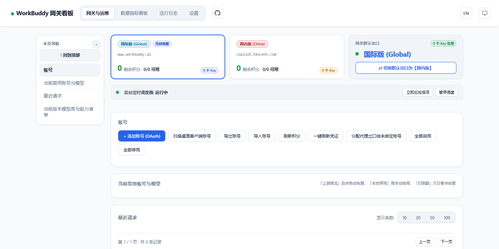
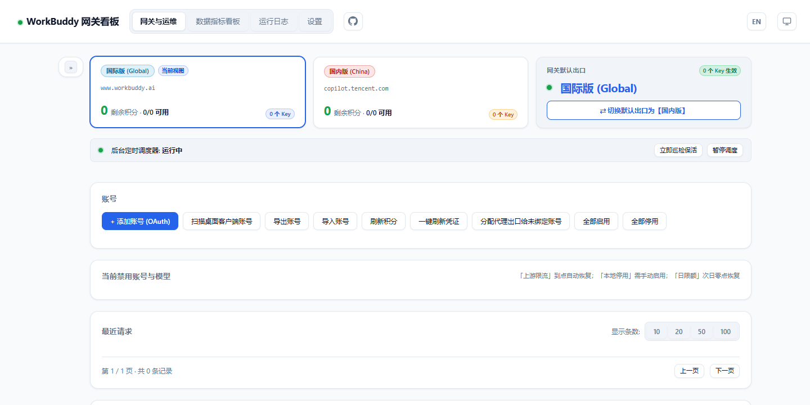

# wb2api-hub 面板侧栏导航

给 [workbuddy2api-hub](https://github.com/ardeyouxipianyi/workbuddy2api-hub) 面板恢复**「本页区块导航」侧栏**的用户脚本。

面板 v1.6.16 之后的上游提交把自带的侧栏导航停用了（`initPageNav()` 变成空壳、`.page-sidebar` 被 `display:none` 隐藏）。这个脚本在浏览器侧把它装回来，**不改动面板本体的任何文件**：升级面板、换镜像、重新拉容器都不会把它冲掉。



## 功能

- **按区块现场生成导航**：扫描当前页面的区块（`section`），标题取区块首个 `h2` 的文本，自动生成导航项。增删区块、调整顺序、以后新增页面，都不需要改脚本。
- **滚动高亮**：页面滚动时，导航项跟着当前所在区块走，滚到底会点亮最后一项。
- **回到顶部**：侧栏顶部的按钮，一键回顶并清掉 URL 锚点。
- **可收起**：宽屏下可以把整列压成一条细轨，把宽度让给内容区；状态跨页面、跨刷新保持。
- **锚点可分享**：点击导航项会把 `#锚点` 写进地址栏，复制链接给别人，打开就直接落到那个区块。
- **窄屏自适应**：窗口宽度 ≤860px 时，侧栏自动变成横排在内容上方的一行胶囊，横向可滚。
- **与面板自带侧栏兼容**：如果面板自己那条侧栏仍然可用，脚本会自动让位，不会出现并排两条。



## 安装

1. 装一个用户脚本管理器：[Tampermonkey](https://www.tampermonkey.net/) 或 Violentmonkey。
2. 打开 [`wb2api-hub-sidebar-nav.user.js`](./wb2api-hub-sidebar-nav.user.js)，点管理器的「安装/Install」。

   > 用 Greasy Fork 之类平台时，直接点脚本页的安装按钮即可。
3. 打开你的面板页面，侧栏就会出现在内容区左侧。

## 生效范围

脚本的 `@match` 写得比较宽（所有 `http`/`https` 页面），真正的开关是运行时判断：**只有页面里同时存在多个 `.main-page` 和至少一个 `<header>` 才动手**。因此在你自己的面板以外的站点上，它什么都不做。

想收窄范围，改脚本头部这两行即可（只留自己的面板地址，改完保存就生效）：

```
// @match        http://*/*
// @match        https://*/*
```

例如只在自己的面板上跑：

```
// @match        http://192.168.1.10:10202/*
```

## 与面板自带的侧栏

面板自带的那条侧栏用的是 `.page-sidebar` / `.page-nav-*` 这套类名。本脚本一律用 `.wbpn-*` 前缀（`wbpn-body` / `wbpn-sidebar` / `wbpn-nav` / `wbpn-item` …），所以**两边不会互相干扰**，面板将来把这些类名删掉、复用或改语义都不影响本脚本。

如果面板自己那条侧栏还是可用的（例如从某个仍带该功能的分支构建的面板），脚本会检测到并**退出**，把自己插入的东西（含包裹内容的那层容器）全部撤掉——这时你不需要这个脚本。

**面板里那批侧栏残留代码在不在，对本脚本没有任何影响。** 实测把同一个脚本分别注入「上游 `main`（残留还在，但已被停用）」和「残留被彻底删除的分支」两份 `dashboard.html`：四个主页面的 DOM 结构、计算样式、侧栏与整屏截图的 SHA-256 **逐字节一致**。所以不必为了这个脚本去动面板文件，也不必为了清理面板而担心脚本失效。

## 验证

仓库自带一套无头浏览器验收（Playwright + Chromium），把脚本按「用户脚本」的方式在页面脚本之前注入，然后逐条断言行为契约。断言里的期望导航项是**从面板 HTML 静态数出来的**，不是脚本自己算的，所以能真正发现「少一项 / 多一项 / 标题带上了状态数字」这类错误。

```bash
npm i                 # 只需要 playwright-core，不会下载浏览器
npm run verify        # 跑离线夹具 verify/fixture.html
npm run verify:real   # 拉取上游固定提交的真实 dashboard.html 再跑同一套断言
```

浏览器可执行文件按 `--chrome <路径>` → 环境变量 `CHROME_PATH` → 本机 `ms-playwright` 缓存目录的顺序查找；找不到时直接用系统已有的 Chromium 也行。

### 在你自己已经跑起来的面板上验

`verify-live.mjs` 会登录你的面板、注入脚本，在真实数据和真实轮询下验行为。只做导航与展开收起，不点任何会改服务端状态的按钮。

```bash
PANEL_URL=http://192.168.1.10:10202 PANEL_PASSWORD=你的面板密码 node verify/verify-live.mjs
```

密码建议走环境变量（别落在进程列表里）。活面板的区块清单会随数据变（例如国内版成长任务区块整块显隐），所以这里不硬编码清单，改验两类不依赖清单的性质：

- **健全性**：每个导航项都指向一个真实的顶层 `section`，且标题与该项文本一致；
- **完整性**：页面里每个「可导航区块」都在清单里，一个不漏。

### 当前结果

| 被测对象 | 用例 | 结果 |
| --- | --- | --- |
| 上游真实 `dashboard.html`（固定提交 `5a04d08`） | 32 | 32 通过 / 0 失败 |
| 离线夹具 `verify/fixture.html` | 32 | 32 通过 / 0 失败 |
| 运行中的真实面板（登录后，真实数据） | 22 | 22 通过 / 0 失败 |

`verify.mjs` 覆盖：侧栏生成与清单正确性（含 `display:none` 区块、无 `h2` 区块、嵌套区块都不成项）、标题剔除状态 `<em>`、点击跳转与锚点、吸顶偏移、滚动高亮与滚到底、回到顶部、收起与刷新后保持、切标签页各自重建、区块不足两项的页面不给侧栏、重复运行不重复包裹/不重复插侧栏、窄屏胶囊行、面板自带侧栏可用时让位、**悬停态不被宿主面板的全局 `button` 样式污染**、脚本自身零报错。

`verify-live.mjs` 另加：登录闸门、面板自带侧栏确实已不可用、四项导航健全性、逐页清单与页面区块一一对应、以及**等一轮面板轮询**后侧栏仍在且清单不变（面板每几秒重建表格，这是最容易把高亮抖掉的地方）。

复跑后截图落在 `verify/shots/`（已 gitignore）。

## 已知限制

- 侧栏依赖面板的 `.main-page` / `section` / `h2` 结构。面板若把区块标签换成别的元素，需要相应调整 `sectionsOf()`。
- 样式复用面板的 CSS 变量（`--panel` / `--line` / `--fg` …），都带了兜底值；面板换主题能自动跟随，但视觉细节以面板主题为准。

## 许可

[MIT](./LICENSE)
